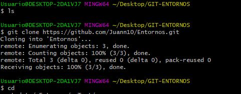
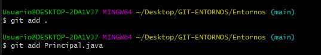
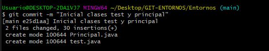
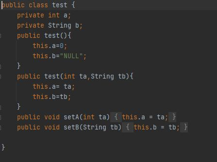
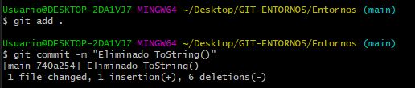

# Tarea6

Esta es la captura de la inicializacion del repositorio GIT

En este caso estoy añadiendo a preparado los dos archivos java tanto Principal como test 

En esta captura se puede ver el primer commit para especificar la inciacion de test y principal

Aqui se ve el archivo de test sin el toString

En esta captura se aprecia como añado de nuevo el archivo modificado y a parte realizo el commit especificando que he eleminado el toString

¿Que hace el @Override?

El Overrride se utilia para forzar el compilador a comprobar si se esta sobreescribiendo bien el metodo

¿Que crees que hace el metodo ToString?

El metodo ToString servia para devolver el resltado